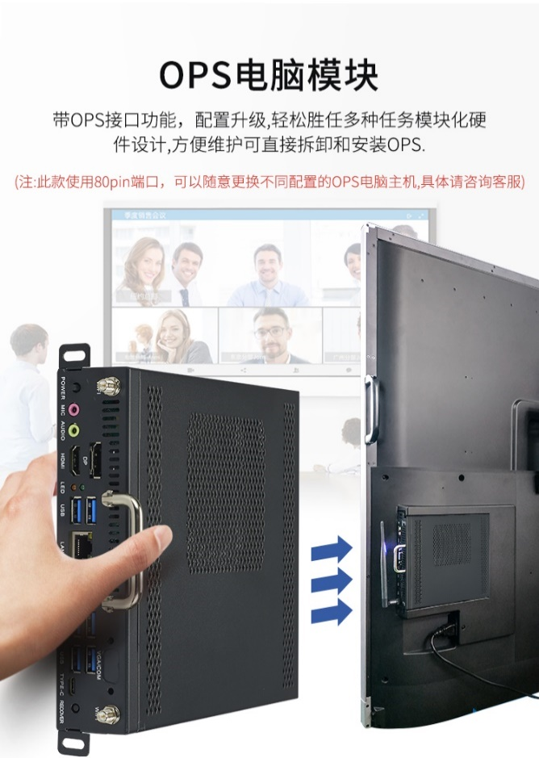

PC 模块是我们日常接触最多的部分。大部分的教学~~以及游戏~~工作都在 PC 模块中进行。

在大部分一体机中，PC 模块作为 OPS 主机插入到一体机中，并通过一体机的屏幕显示与触摸。

PC 模式下的一体机基本上就是一台带有触摸的 PC，功能与普通 PC 相差不大。其配置强弱由学校的资金是否雄厚来决定，一般是中低端 CPU + 亮机卡/核显 + 小厂 SSD。通过上图方式连接到 [Android 部分](android-part)。

一般来说，希沃一体机自带的 PC 模块型号以 MT 开头。具体型号可使用 AIDA64 等软件查看。
